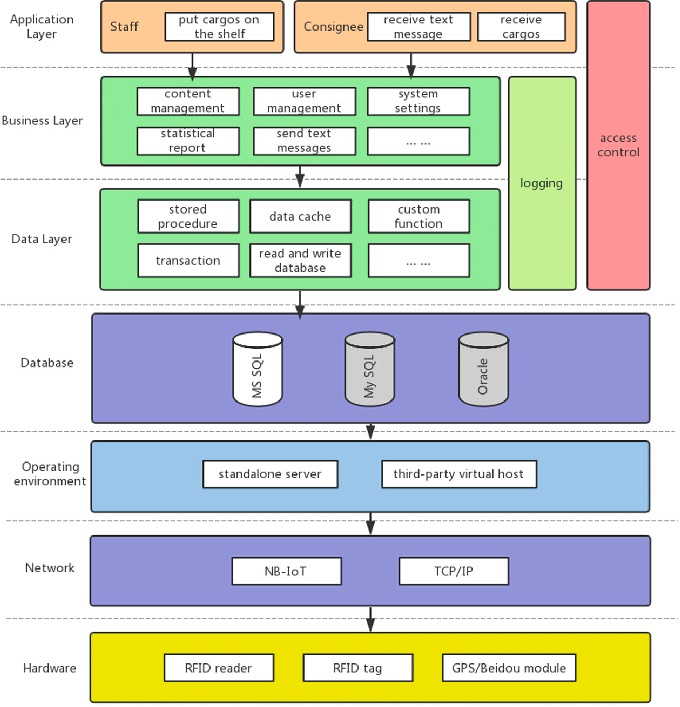
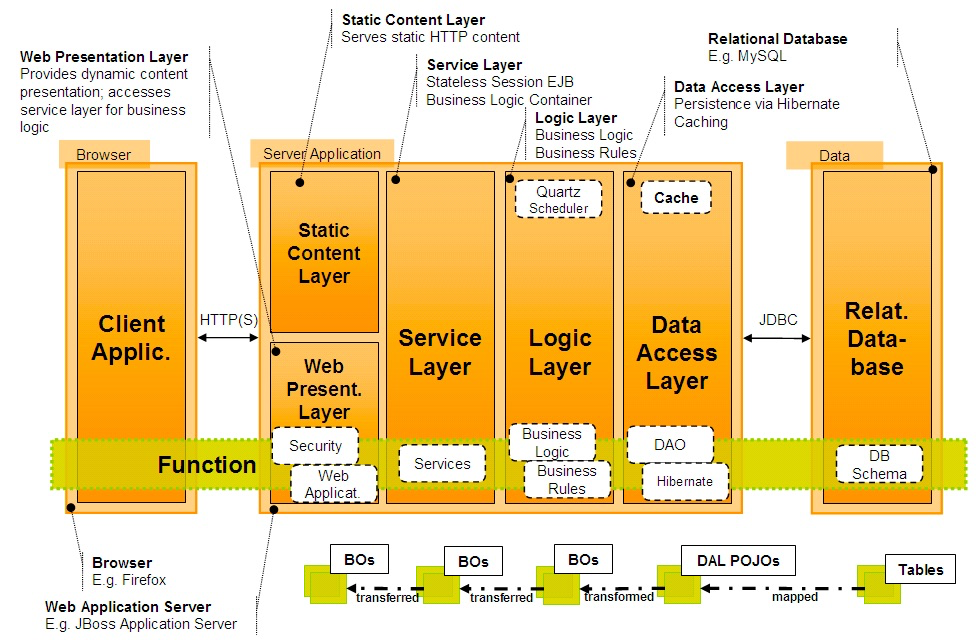

# Layer diagram

In summary: a high-level view of the architecture of software system.

What it includes?

- presentation layer
- business layer
- persistence layer
- data layer

Direction: top-down

Two examples for illustration:

[drawio: work with layers](https://www.drawio.com/doc/layers)